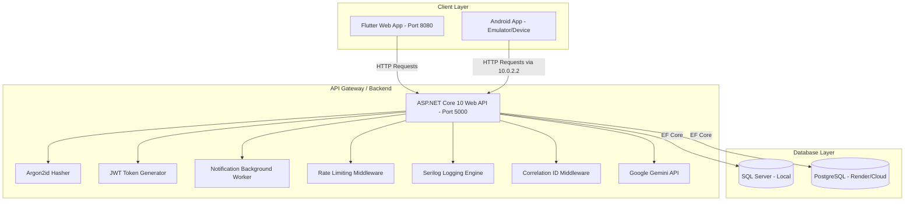

# BHAU FITNESS — Project Documentation & Architecture Guide

Welcome to the official documentation for **BHAU FITNESS**, a premium, full-stack fitness platform built using a modern mobile-first architecture. This document provides an exhaustive overview of the system architecture, directory structure, features, database design, testing, infrastructure, and setup procedures.

---

## 1. Project Overview

**BHAU FITNESS** is a high-performance fitness platform designed for both public marketing and private member engagement. It consists of:
1.  **Frontend (Flutter):** A single, cross-platform codebase compiling to a responsive Web Application and a native Android App (APK).
2.  **Backend (ASP.NET Core 10):** A secure, scalable RESTful Web API managing business logic, user authentication, and data persistence.
3.  **Database (SQL Server / PostgreSQL):** A relational database storing members, plans, bookings, water/workout logs, payments, notifications, and system configurations.

---

## 2. Technology Stack

### Frontend (Mobile & Web)
*   **Framework:** Flutter (Dart)
*   **State Management:** `provider` (MultiProvider architecture)
*   **Network Client:** `http` with custom header interceptors and dynamic base URL resolution (supporting localhost `10.0.2.2` bridges on Android emulators)
*   **Local Storage:** `flutter_secure_storage` (secure token storage)
*   **Aesthetics:** Dark Theme (Glassmorphism, custom linear gradients, neon cyan and lime accents)
*   **Charts:** `fl_chart` for admin dashboard analytics and trends
*   **Animations:** Custom `AnimationController`s, Ken Burns zooming effects, elastic curves, and web-safe layout builders.

### Backend (API)
*   **Framework:** ASP.NET Core 10.0 Web API
*   **ORM:** Entity Framework Core (EF Core)
*   **Security & Auth:** JWT Bearer tokens, ASP.NET Core Identity
*   **Password Hashing:** `Argon2id` via custom `Argon2PasswordHasher` (using `Isopoh.Cryptography.Argon2`)
*   **Database Providers:** Dual support (SQL Server for local dev, PostgreSQL for production/PaaS hosting)
*   **Background Services:** Hosted background workers (`IHostedService`) for automated notifications
*   **Logging:** Structured logging via **Serilog** (Console and rotating file sinks) with **Correlation ID** request enrichment
*   **Rate Limiting:** Sliding/Fixed window rate limiting middleware (`Microsoft.AspNetCore.RateLimiting`)
*   **Health Checks:** Integrated ASP.NET Core health checks with database liveness validation
*   **AI Integration:** Real **Google Gemini API** integration via typed `HttpClient` with a robust local rule-based fallback

---

## 3. System Architecture



---

## 4. Codebase Directory Structure

### Frontend: `frontend/bhau_fitness_flutter/`
```
lib/
├── main.dart                 # App entrypoint & SplashGate router
├── brand_config.dart         # Tenant configurations (branding, addresses, maps)
├── theme/
│   ├── app_theme.dart        # Unified theme (BhauColors, BhauText, BhauDecor)
│   ├── responsive.dart       # Breakpoints & ContentMaxWidth layout containers
│   └── animations.dart       # Web-safe fade/slide transitions & blurs
├── models/
│   ├── user.dart             # Member/Admin profile model
│   ├── membership.dart       # Subscription & status model
│   ├── plan.dart             # Subscription pricing plan model
│   ├── class_session.dart    # Weekly schedule class model
│   └── water_log.dart        # Water intake tracking model
│   └── workout_log.dart      # Workout exercise logging model
├── providers/
│   ├── auth_provider.dart    # Manages login/register/logout states
│   ├── engagement_provider.dart # Manages water, workouts, and badges
│   └── notification_provider.dart # Handles notifications and unread badges
├── services/
│   ├── api_service.dart      # Dynamic base URL resolver, HTTP client & API endpoints
│   ├── auth_service.dart     # Authentication & plans API endpoints wrapper
│   ├── portal_service.dart   # Bookings & logging API endpoints wrapper
│   ├── external_links.dart   # External deep links (WhatsApp, Maps)
│   └── token_storage.dart    # Encrypted local storage interface
├── screens/
│   ├── landing/              # Public marketing website
│   │   ├── landing_screen.dart
│   │   ├── landing_data.dart # Holds static programs, equipment, & testimonials
│   │   └── sections/         # Hero, About, Programs, Testimonials, FAQ, Footer
│   ├── auth/                 # Login & Registration screens
│   ├── member/               # Private Member Portal
│   │   ├── member_shell.dart # Bottom nav shell for Member Portal
│   │   ├── dashboard_tab.dart # Main dashboard, water tracker, payment checkout
│   │   ├── schedule_tab.dart # Weekly schedule class booking grid
│   │   ├── profile_tab.dart  # Profile details & workout logger
│   │   ├── ai_coach_screen.dart # AI Workout & Diet recommendation engine
│   │   ├── payment_history_screen.dart # User billing & invoice history
│   │   └── notifications_screen.dart # Expiring warning & class reminders list
│   └── admin/                # Private Admin Portal
│       ├── admin_shell.dart  # Sidebar navigation shell for Admin Portal
│       ├── roster_tab.dart   # Member roster list with manual override controls
│       ├── classes_tab.dart  # Schedule session editor & booking logs
│       └── analytics_screen.dart # Revenue charts, plan distribution, & popular classes
assets/
└── images/                   # Local assets (Logos, splash screen, transformations, AI equipment)
test/
└── widget_test.dart          # Frontend compile & launch widget test
```

### Backend: `backend/BhauFitnessApi/`
```
BhauFitnessApi/
├── Controllers/
│   ├── AuthController.cs     # Login, Profile, Password Reset (Thin Controller)
│   ├── AdminController.cs    # Member roster, grant/deactivate, system overview
│   ├── ClassesController.cs  # Class session scheduling (Thin Controller)
│   ├── BookingsController.cs # Class session bookings (Thin Controller)
│   ├── PlansController.cs    # Pricing plan creation & retrieval
│   ├── ActivitiesController.cs # Water & workout logging endpoints
│   ├── PaymentsController.cs # Razorpay order creation (Thin Controller)
│   ├── AiCoachController.cs  # Personalized workout/diet generators (Thin Controller)
│   └── AnalyticsController.cs # System revenue, plan distribution, & class booking stats
├── Data/
│   ├── ApplicationDbContext.cs # Database context, seeds, tenant filter configuration
│   └── Migrations/           # EF Core database schema migrations
├── Models/
│   ├── Entities/             # IMultitenant, User, Plan, Booking, Logs, Payment, Notification
│   └── DTOs/                 # Request/Response data transfer objects
├── Services/
│   ├── IUserService.cs / UserService.cs         # Registration & user business logic
│   ├── IMembershipService.cs / MembershipService.cs # Subscriptions & Razorpay logic
│   ├── IClassService.cs / ClassService.cs       # Weekly schedule & bookings logic
│   ├── AiCoachService.cs     # Real Gemini API integration & fallback logic
│   ├── Argon2PasswordHasher.cs # Cryptographic password hashing
│   ├── EmailSender.cs        # SMTP/Console password reset fallback
│   ├── RazorpayService.cs    # Razorpay order creator & signature verifier
│   ├── TenantProvider.cs     # Resolves Tenant ID from HttpContext headers
│   ├── DatabaseHealthCheck.cs # Health check verification for database
│   ├── CorrelationIdMiddleware.cs # Request correlation ID injector
│   └── NotificationTriggerService.cs # Background hosted service checking database records
├── Program.cs                # Dependency injection, middleware, Serilog & Rate Limiting setup
└── appsettings.json          # Database connection strings & JWT settings
```

---

## 5. Core Features & Implementation Details

### 🔒 Secure Authentication & Argon2id
*   **JWT Handshake:** Secure login issuing signed JSON Web Tokens. Stored tokens are validated on startup; users bypass the login screen if their session is active.
*   **Argon2id Security:** Passwords are never stored in plain text. They are hashed using the industry-standard Argon2id algorithm, configured via `Isopoh.Cryptography.Argon2` on the backend.

### 🏢 Multi-Tenant (Multi-Gym) Support
*   **Single-Database Multi-Tenancy:** Implemented using EF Core **Global Query Filters** and the `IMultitenant` interface. All entity queries are automatically filtered by `TenantId`.
*   **Resolution:** The backend resolves the current tenant dynamically from the `X-Tenant-Id` HTTP header via `HttpContextTenantProvider`.
*   **Automation:** New records automatically capture and persist the current request's `TenantId` during `SaveChanges/SaveChangesAsync` hooks.

### 🛡️ Rate Limiting & Security Hardening
*   **Rate Limiting:** Protects sensitive endpoints (Auth and Payments) from brute-force/DDoS attacks using a fixed window policy (10 requests/minute, rejection code `429`).
*   **CORS Policy:** Restricts access to trusted origins using configured allowed hosts with credential support.

### 💳 Razorpay Payments & Membership
*   **Plan Options:** Basic (₹1,499), Premium (₹2,999), and Elite (₹4,999).
*   **Razorpay Integration:** Backend creates orders and verifies payments using HMAC-SHA256 signature verification. Includes a local mock checkout flow on the frontend for seamless testing in dev environments.
*   **Active Tracking:** Dashboard shows start date, end date, and a dynamic progress bar displaying days remaining.

### 🤖 Real AI Coach (Google Gemini Integration)
*   **Gemini API Integration:** The `AiCoachService` uses a typed `HttpClient` to call the official Google Gemini API (`gemini-2.5-flash` model), sending structured prompts to generate customized 7-day workouts and diet plans.
*   **Robust Fallback:** If the Gemini API Key is unconfigured or a network error occurs, the service gracefully falls back to a high-quality local rule-based generator, ensuring 100% uptime.

### 📅 Class Bookings
*   **Weekly Schedule:** Interactive grid displaying Cardio, Strength, and Functional classes.
*   **Capacity Management:** Real-time capacity checks preventing overbooking. Members can book classes and cancel bookings. Bookings are automatically sorted chronologically.

### 🔔 In-App Notification System
*   **Expiring Warning:** Automatically triggers an in-app notification when a member's subscription has 3 days or less remaining.
*   **Class Reminders:** Triggers a reminder notification 24 hours before a booked class session.
*   **Background Worker:** Managed by `NotificationTriggerService.cs`, a background hosted service that scans the database hourly to fire notification events.
*   **Frontend Badge:** A notification bell icon in the header shows a real-time unread count badge.

### 📊 Admin Analytics Dashboard
*   **System Overview:** High-level dashboard showing total members, active memberships, monthly revenue, and churn rate.
*   **Charts:** Includes dynamic line charts for 12-month revenue trends, pie charts for membership plan distribution, and progress bars for class popularity.

---

## 6. Infrastructure & Deployment

### 🐳 Docker Configurations
A multi-stage `Dockerfile` is configured for the backend API, allowing it to build and run in an isolated environment. The `docker-compose.yml` file links the API with a SQL Server container:
```yaml
version: '3.8'
services:
  db:
    image: mcr.microsoft.com/mssql/server:2022-latest
    environment:
      - ACCEPT_EULA=Y
      - MSSQL_SA_PASSWORD=YourStrongPassword123!
    ports:
      - "1433:1433"

  api:
    build:
      context: ./backend
      dockerfile: BhauFitnessApi/Dockerfile
    ports:
      - "5000:8080"
    environment:
      - ConnectionStrings__DefaultConnection=Server=db;Database=BhauFitnessDb;User Id=sa;Password=YourStrongPassword123!;TrustServerCertificate=True;
    depends_on:
      - db
```

### 🚀 Cloud Deployment (`render.yaml`)
A [render.yaml](render.yaml) file is included in the project root to support automated Infrastructure-as-Code deployment on the **Render** platform. Database, CORS origins, and API keys are provided via Render environment variables (`sync: false` entries) — never committed.

### 💾 Automated Backups & Disaster Recovery (`backup.sh`)
The [backup.sh](backup.sh) shell script provides automated scheduled backup and restore procedures:
*   `backup-pg` / `restore-pg`: Backup/Restore production PostgreSQL databases.
*   `backup-ms`: Backup local SQL Server database inside the Docker container.

### 🚀 CI/CD GitHub Actions Workflow
The [.github/workflows/ci.yml](.github/workflows/ci.yml) workflow automatically runs on every push and pull request to the `main` branch, executing:
1.  **Backend:** Restores dependencies, builds the API, and runs all xUnit tests.
2.  **Frontend:** Installs the Flutter SDK, analyzes the codebase (`flutter analyze`), and runs all widget tests (`flutter test`).

---

## 7. Testing Guide

### 1. Backend xUnit Tests
The [BhauFitnessApi.Tests](backend/BhauFitnessApi.Tests/BhauFitnessApi.Tests.csproj) project contains unit tests for controllers and services. To run the backend tests, navigate to the project root and run:
```bash
dotnet test backend/BhauFitnessApi.Tests/BhauFitnessApi.Tests.csproj
```

### 2. Frontend Widget Tests
To run the Flutter widget and unit tests, navigate to the frontend directory and run:
```bash
cd frontend/bhau_fitness_flutter
flutter test
```

---

## 8. Seeded Credentials (Local Dev)

To facilitate local testing, the backend database automatically seeds the following credentials on its first run:

### 🔑 Administrator Account
*   **Email:** `admin@bhau.com`
*   **Password:** `AdminPassword123`
*   **Role:** `Admin` (grants access to the Admin Portal on both Web and Mobile)

### 🔑 Member Account
*   **Email:** `member@bhau.com`
*   **Password:** `MemberPassword123`
*   **Role:** `Member`

---

## 9. Setup & Run Guide

### 1. Database Migrations
Ensure SQL Server is running locally. Navigate to the backend directory and run:
```bash
cd backend/BhauFitnessApi
dotnet ef migrations add AddMultiTenancy
dotnet ef database update
```

### 2. Launch the Backend API
```bash
dotnet run --urls "http://localhost:5000"
```
The database will be automatically created, migrated, and seeded on startup.

### 3. Launch the Web Application
```bash
cd frontend/bhau_fitness_flutter
flutter run -d chrome --web-port=8080
```

### 4. Launch the Android App on Emulator
Start your Android Emulator, then run:
```bash
cd frontend/bhau_fitness_flutter
flutter run -d emulator-5554
```

---

## 10. Build & Export APK
To generate a release-ready Android APK:
```bash
cd frontend/bhau_fitness_flutter
flutter build apk --release
```
The output file is exported directly to your Desktop at:
`C:\Users\shanu\Desktop\bhau_fitness.apk`
