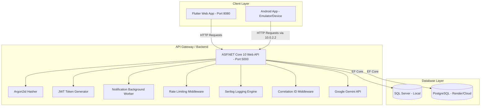

# BHAU FITNESS — Enterprise-Grade Full-Stack SaaS Platform

BHAU FITNESS is a premium, high-performance, multi-tenant fitness SaaS platform designed for modern gyms. It features a cross-platform **Flutter** frontend (Web & Android APK) and a robust **ASP.NET Core 10** Web API backend backed by **SQL Server** and **PostgreSQL**.

The application is architected for high security, operational excellence, and seamless user engagement.

---

## 📸 Platform Architecture & Flow



---

## ✨ Core Features Implemented

### 🏢 1. Single-Database Multi-Tenancy (Multi-Gym)
*   **Dynamic Resolution:** Gyms are resolved dynamically via the `X-Tenant-Id` HTTP header.
*   **Global Query Filters:** EF Core automatically applies query filters to isolate data per gym tenant.
*   **Automated Save Hooks:** New records automatically capture and persist the current tenant ID during save operations.

### 💳 2. Razorpay Payment Gateway Integration
*   **Order Creation:** Secure backend order generation using the Razorpay API.
*   **Signature Verification:** Automated payment verification using HMAC-SHA256 signature checks.
*   **Mock Checkout Flow:** A seamless local sandbox checkout flow on the frontend for testing.

### 🤖 3. Real AI Coach (Google Gemini Integration)
*   **Gemini API Integration:** The `AiCoachService` uses a typed `HttpClient` to call the official Google Gemini API (`gemini-2.5-flash` model), sending structured prompts to generate customized 7-day workouts and diet plans.
*   **Robust Fallback:** If the Gemini API Key is unconfigured or a network error occurs, the service gracefully falls back to a high-quality local rule-based generator, ensuring 100% uptime.

### 📊 4. Interactive Admin Analytics
*   **Revenue Trends:** 12-month revenue trend line charts built using the `fl_chart` library.
*   **Membership Distribution:** Pie charts showing the breakdown of Basic, Premium, and Elite memberships.
*   **Class Popularity:** Visual progress indicators showing class booking ratios.

### 🔔 5. In-App Notifications & Background Services
*   **Expiry Warnings:** Alerts members 3 days before their membership expires.
*   **Class Reminders:** Sends a notification 24 hours before a booked class.
*   **Automated Worker:** An hourly background hosted service (`IHostedService`) scans database records to trigger alerts.

### 🔒 6. Security Hardening
*   **Argon2id Hashing:** High-security cryptographic password hashing.
*   **JWT Authentication:** Secure token-based stateful authentication.
*   **Rate Limiting:** Protects auth/payment routes using a per-client fixed-window policy (10 requests/minute per IP).
*   **Login Lockout:** 5 failed password attempts lock the account for 5 minutes.
*   **Health Checks:** Endpoint at `/api/health` verifying database and background service liveness.

---

## 🛠️ Technology Stack

*   **Frontend:** Flutter (Dart), Provider (State Management), `fl_chart`, `flutter_secure_storage`.
*   **Backend:** ASP.NET Core 10, EF Core, ASP.NET Core Identity, Serilog, Rate Limiting, Google Gemini API.
*   **Database:** SQL Server (Development), PostgreSQL (Production).
*   **DevOps:** Docker, Docker Compose, GitHub Actions (CI/CD), Render Cloud.

---

## 🚀 Quick Start Guide

### 1. Prerequisites
*   [.NET 10 SDK](https://dotnet.microsoft.com/download/dotnet/10.0)
*   [Flutter SDK](https://flutter.dev)
*   SQL Server (Local or Docker)

### 2. Database Migration & Setup
Navigate to the backend directory and run:
```bash
cd backend/BhauFitnessApi
dotnet ef database update
```
*Note: The database will be automatically created and seeded with demo administrator (`admin@bhau.com` / `AdminPassword123`) and member (`member@bhau.com` / `MemberPassword123`) credentials.*

### 3. Start the Backend API
```bash
dotnet run --urls "http://localhost:5000"
```
*Browse to [http://localhost:5000/swagger](http://localhost:5000/swagger) to view the interactive Swagger/OpenAPI documentation.*

### 4. Start the Frontend App
Navigate to the frontend directory and run:
```bash
cd frontend/bhau_fitness_flutter
flutter pub get
flutter run -d chrome --web-port=8080
```

---

## 🐳 Docker Orchestration

To spin up the entire stack (API + SQL Server Database) using Docker Compose, run:
```bash
docker-compose up --build
```

---

## 🧪 Testing

### Backend Unit Tests (xUnit)
Run the backend unit test suite:
```bash
dotnet test backend/BhauFitnessApi.Tests/
```

### Frontend Widget Tests
Run the Flutter widget tests:
```bash
cd frontend/bhau_fitness_flutter
flutter test
```

---

## 💾 Database Backups

A [backup.sh](backup.sh) script is provided in the project root to automate database backups:
*   **Backup PostgreSQL (Production):** `./backup.sh backup-pg`
*   **Restore PostgreSQL (Production):** `./backup.sh restore-pg [file]`
*   **Backup SQL Server (Local Docker):** `./backup.sh backup-ms`
